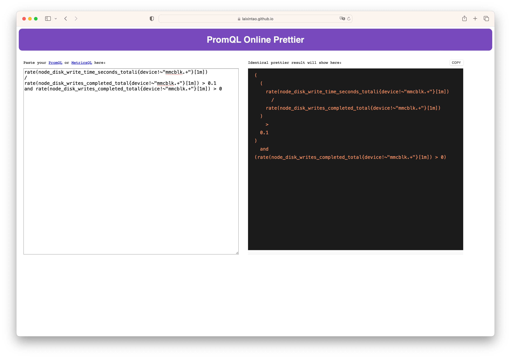

#  PromQL & MetricsQL Prettify!

Make your PromQL or MetricsQL beautiful.

<!-- vim-markdown-toc GFM -->

- [Usage](#usage)
  - [Online Tools](#online-tools)
  - [Command-line](#command-line)
- [Thanks](#thanks)

<!-- vim-markdown-toc -->

## Usage

### Online Tools

https://laixintao.github.io/promql-metricsql-prettify/



### Command-line

Installation:

```shell
go install github.com/laixintao/promql-metricsql-prettify@latest
```

Usage: pass your PromQL or MetricsQL into `promql-metricsql-prettify` as stdin:

```shell
$ echo 'count(sum(label_replace(node_uname_info, "kernel", "$1", "release", "([0-9]+.[0-9]+.[0-9]+).*")) by (kernel)) > 1' | promql-metricsql-prettify
count(
  sum(
    label_replace(
      node_uname_info,
      "kernel",
      "$1",
      "release",
      "([0-9]+.[0-9]+.[0-9]+).*"
    )
  ) by(kernel)
)
  >
1
```

## Thanks

- This project was inspired by https://github.com/jiacai2050/promql-prettier
- This project uses [VictoriaMetrics](https://github.com/VictoriaMetrics)'s code, [`prettier.go`](https://github.com/VictoriaMetrics/metricsql/blob/master/prettifier.go) in [MetricsQL](https://github.com/VictoriaMetrics/metricsql/)
